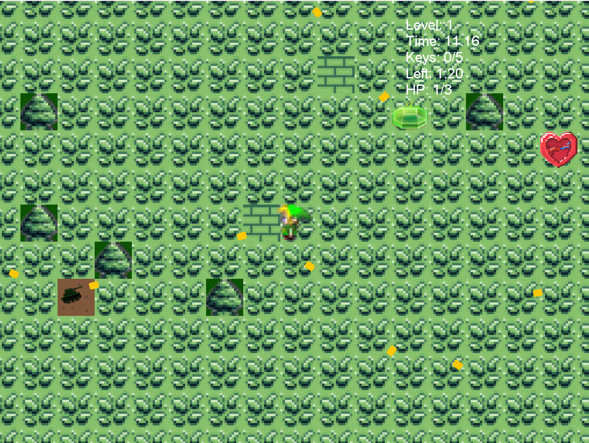

# My2dGame

A 2D top-down action game built with Java and Swing. Collect keys to clear levels, avoid shooter enemies, and use heal/time gems before time runs out.

## Screenshot



*In-game: level, keys, HP, timer, shooter enemy, and collectible gems.*

---

## Concept & Features

- **Level-based gameplay** — Complete each level by collecting the required number of key gems within a 90-second time limit.
- **Shooter enemies** — Enemies fire bullets at the player; higher levels increase fire rate (difficulty scaling).
- **Collectibles**
  - **Key gems** — Progress toward level completion (required count per level: 5 → 6 → 7 → 8 → 10).
  - **Heal gems** — Restore 1 HP (count scales with level: L1 = 3, L2 = 4, …).
  - **Time gems** — Add 15 seconds to the level timer (same scaling as heal gems).
- **Player** — 3 HP, invincibility frames after hit, damage indicator (-1) and green +1 when collecting gems.
- **Level flow** — Level clear → short “LEVEL CLEAR!” banner → next level starts; final level → “YOU WIN!” → game restarts from level 1.

---

## Tech Stack

| Area        | Technology        |
|------------|--------------------|
| Language   | Java               |
| GUI        | Java Swing (JFrame, JPanel) |
| Graphics   | Java 2D (Graphics2D)       |
| Threading  | Game loop on a dedicated thread (60 FPS) |
| Assets     | PNG images, WAV audio, text maps |

---

## Project Structure

```
My2dGame/
├── src/
│   ├── Main/           # GamePanel, DriverClass, Collision, AssetSet, KeyHandler
│   ├── entity/         # Player, ShooterEnemy, Bullet, Entity
│   ├── object/         # KeyObject, key, HealGem, TimeGem
│   ├── tiles/          # TileManage, Tiles (map & tile rendering)
│   └── Sound/          # Sound (music & SFX)
├── resources/
│   ├── enemy/          # enemy.png (shooter sprite)
│   ├── gem/            # heal.png, time.png (optional; fallback to key.png)
│   ├── objects/        # key.png (key gem)
│   ├── player/         # movement sprites (up, down, left, right)
│   ├── tiles/          # grass, wall, water, earth, sand, tree
│   ├── sound/          # music & gem collect SFX
│   └── maps/           # map data (optional)
├── build.bat            # Compile + copy resources (Windows)
├── run.bat              # Run game (Windows)
└── README.md
```

---

## Prerequisites

- **Java Development Kit (JDK)** — Version 11 or higher (e.g. JDK 17 or 23).
- **Windows** — Scripts use `build.bat` and `run.bat`; on macOS/Linux use equivalent `javac`/`java` commands (see below).

Ensure `java` and `javac` are on your PATH, or set `JAVA_HOME` so the build script can find the compiler.

---

## Installation & How to Run

### Option 1: Windows (batch scripts)

1. **Clone or download** the repository and open a terminal in the `My2dGame` folder.

2. **Build** (compile and copy resources):
   ```bat
   build.bat
   ```
   This compiles all `.java` files into `out\production\My2dGame` and copies `resources\*` there so the game finds images and sounds.

3. **Run the game**:
   ```bat
   run.bat
   ```
   Or double-click `run.bat`.

### Option 2: Command line (any OS)

From the project root `My2dGame/`:

```bash
# Compile
javac -encoding UTF-8 -d out/production/My2dGame -cp "out/production/My2dGame" \
  src/Main/*.java src/entity/*.java src/object/*.java src/Sound/*.java src/tiles/*.java

# Copy resources (Windows: xcopy /E /I /Y resources\* out\production\My2dGame\)
# macOS/Linux:
cp -r resources/* out/production/My2dGame/

# Run
java -cp "out/production/My2dGame" Main.DriverClass
```

### Option 3: IDE (IntelliJ IDEA / Eclipse)

1. **Open** the project as a Java project (e.g. “Open” the `My2dGame` folder).
2. **Mark** `resources` as Resources Root (or copy output to the same path as your run configuration’s classpath).
3. **Build** the project (e.g. Build → Rebuild Project).
4. **Run** the main class: `Main.DriverClass`.

---

## Controls

| Key   | Action   |
|-------|----------|
| **W / ↑** | Move up   |
| **S / ↓** | Move down |
| **A / ←** | Move left |
| **D / →** | Move right |
| **P**     | Pause / Resume |

---

## Customizing Assets

- **Enemy sprite** — Replace `resources/enemy/enemy.png`. The game uses this for shooter enemies; if missing, it falls back to the player sprite with a red tint.
- **Gems** — Place `resources/gem/heal.png` and/or `resources/gem/time.png` to use custom art for heal and time gems. Key gem uses `resources/objects/key.png`.
- **Player** — Replace sprites in `resources/player/` (e.g. `down01.png`, `left01.png`, etc.) to change the player’s look.

After changing assets, run **build.bat** (or copy `resources` into your run classpath) so the updated files are used when you run the game.

---

## License

This project is provided as-is for learning and personal use. Replace with your preferred license (e.g. MIT) if you publish or share it.
